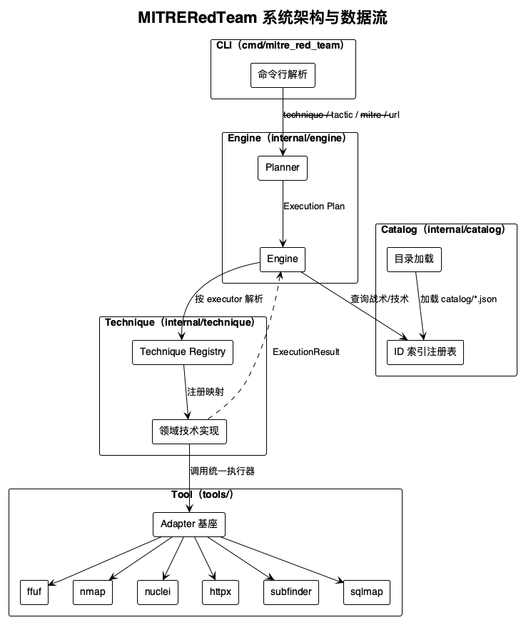
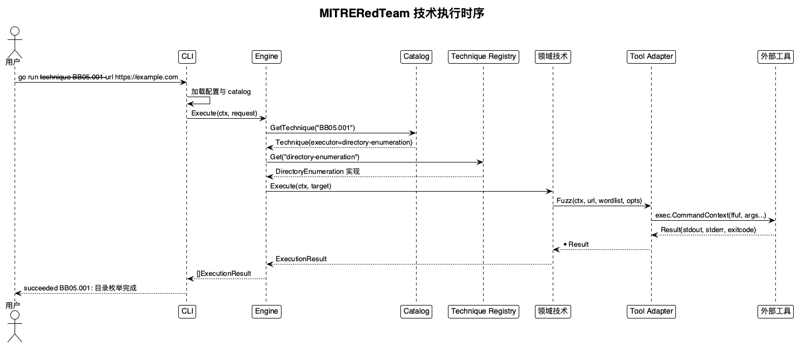

# MITRERedTeam

**授权范围内的红队 / 漏洞赏金 CLI 安全工具**

> **作者**：钟智强 · **许可证**：[GPLv3](https://www.gnu.org/licenses/gpl-3.0.html)

## 目录

- [项目概述](#项目概述)
- [技术规格](#技术规格)
- [系统架构](#系统架构)
- [执行流程](#执行流程)
- [支持的战术](#支持的战术)
- [支持的技术](#支持的技术)
- [工具集成](#工具集成)
- [CLI 参考（API）](#cli-参考api)
- [配置指南](#配置指南)
- [AI 辅助执行](#ai-辅助执行)
- [通知系统](#通知系统)
- [日志系统](#日志系统)
- [目录数据结构](#目录数据结构)
- [扩展指南](#扩展指南)
- [故障排查](#故障排查)
- [版本历史](#版本历史)
- [依赖项](#依赖项)
- [许可证](#许可证)

## 项目概述

MITRERedTeam 是一个用 **Go** 写的授权红队 / 漏洞赏金命令行工具。整个评估流程按**战术（Tactic）**和**技术（Technique）**两级组织，编号是自研的 `BBxx` / `BBxx.xxx`。执行什么、怎么执行都由你说了算——只跑你显式指定的那条技术或那个战术，不会自作主张把清单里的东西全跑一遍，也不会超出你声明的目标范围。

战术和技术的清单放在 `catalog/*.json`，纯数据驱动。MITRE ATT&CK ID 只用来对齐行业标准，不算主标识符。目前目录里有 **25 个战术、27 条技术**，目录枚举的执行器和六类外部工具的适配层都已落地。

**核心特性：**

| 特性 | 描述 |
|---|---|
| 战术驱动 | 25 个战术（BB01–BB25）覆盖侦察、攻击面发现、Web 枚举、注入、业务逻辑、云安全、证据报告等完整评估流程 |
| 数据驱动 | 战术与技术清单定义在 `catalog/*.json`，新增内容无需改动 Go 代码 |
| MITRE 对齐 | 每条技术映射 MITRE ATT&CK ID（如 T1046、T1190、T1083）作为行业标准对齐元数据 |
| 显式执行 | 用户通过 `--technique` / `--tactic` / `--mitre` 显式触发，严格限定在声明目标内 |
| 工具适配层 | ffuf、nmap、nuclei、httpx、subfinder、sqlmap 统一封装，参数构造与超时收敛在适配层 |
| 结构化日志 | 全链路日志携带 RFC3339 时间戳、级别、操作名与内存统计，便于诊断 |
| AI 辅助模式 | 对接六家 LLM 供应商，分析 TTP 执行输出并自动推进建议的下一步技术（最多 3 轮） |
| 通知系统 | Telegram、OpenClaw 微信、本地系统通知三通道 |
| 零第三方依赖 | 仅使用 Go 标准库，Go 1.26 实现 |

## 技术规格

### 运行环境要求

| 项目 | 要求 |
|---|---|
| Go 版本 | ≥ 1.26（`go.mod` 声明 `go 1.26.1`） |
| 操作系统 | 支持 Go 编译目标：macOS / Linux / Windows |
| 本地通知 | macOS（osascript）、Linux（notify-send）、Windows（原生 API），按编译平台自动选择 |
| 第三方依赖 | 零 Go 第三方依赖，仅标准库 |

### 外部工具要求

| 工具 | 用途 | 典型技术 |
|---|---|---|
| ffuf | Web 目录/参数枚举 | BB05.001 目录枚举 |
| nmap | 端口扫描 | BB02.005 端口发现 |
| nuclei | 已知 CVE 检测 | BB22.001 已知 CVE 检测 |
| httpx | HTTP 存活探测 | BB02.001 存活主机发现 |
| subfinder | 子域名枚举 | BB01.003 子域名枚举 |
| sqlmap | SQL 注入检测 | BB10.001 SQL 注入 |

工具路径在 `configs/redteam.json` 的 `tools` 段声明：值为命令名时经 PATH 解析（推荐，跨机器可用）；值为绝对路径时直接使用该二进制。**禁止硬编码工具位置。**

### 设计约束（硬性边界）

- 应用**不是** AI agent，**不得**自动编排执行所有战术。
- 执行必须由用户显式选择，且严格限定在用户声明的目标范围内。
- 战术与技术清单**数据驱动**，存放在 `catalog/` 外部 JSON 中，不得硬编码进 Go 代码。
- 外部命令一律 `exec.CommandContext(ctx, executable, arguments...)`，参数切片传递，不做 shell 解释；禁止 `sh -c`。
- 所有外部调用带 context 超时；工具输出按行数上限约束，防止异常输出拖垮本地资源。
- 技术实现不得直接执行 `exec.Command`，统一经 `tools/` 适配层调用外部工具。
- 凭据与 API Key 只存内存，不回显、不落盘、不写日志。

### 性能与内存指标

| 指标 | 约束 |
|---|---|
| 运行期常驻内存（RSS）峰值 | ≤ 500MB |
| `GOMEMLIMIT` | 480MiB 软限制（可经配置覆盖，上限 500MB） |
| 并发外部工具进程 | 信号量限制（默认最多 4 个） |
| catalog 加载 | `json.Decoder` 流式解码，内存占用与单条记录成正比 |
| 运行时监控 | 每 5 秒采样 `runtime.ReadMemStats`，连续 3 次超限则退出 |

## 系统架构

这套架构叫 **CDRPA**（目录驱动的注册式插件架构），拼了五种套路：目录驱动、注册模式、插件架构、分层架构、依赖倒置。核心系统不碰具体工具和具体技术实现，只认抽象。加新技术、接新工具的时候，尽量不动核心执行引擎。



📁 图表源码：[flow.puml](docs/assets/flow.puml) | 🖼️ PNG：[flow.png](docs/assets/flow.png)

| 层 | 职责 |
|---|---|
| CLI（`cmd/mitre_red_team`） | 解析用户请求（`--tactic` / `--technique` / `--mitre` / `--url`），仅执行用户选定项 |
| Planner | 把用户请求解析为可执行的执行计划 |
| Engine（`internal/engine`） | 编排执行：目录查询、计划调度、结果汇总 |
| Technique Registry（`internal/technique`） | 维护 `executor → 实现` 的注册表，按名称解析 |
| 领域技术 | 具体技术实现，按领域分目录（enumeration、injection 等） |
| Tool 适配层（`tools/`） | 封装外部工具：路径解析、参数构造、超时、输出处理 |
| Result / Evidence / Finding | 执行结果、证据与最终发现的递进产出 |

走一遍完整数据流就是：CLI 收请求 → Planner 出执行计划 → Engine 校验目标并调度 → Technique Registry 按 `executor` 找到对应实现 → 技术实现经 Tool 适配层调用 ffuf、nmap、nuclei 这些外部工具 → 最后产出结构化 Result。

## 执行流程

一次技术执行的时序见下图：



📁 图表源码：[sequence.puml](docs/assets/sequence.puml) | 🖼️ PNG：[sequence.png](docs/assets/sequence.png)

启动阶段会依次做这几件事：

1. **加载环境变量**：读取 `.env`（不存在或条目为空时静默忽略）。
2. **加载配置**：解析 `configs/redteam.json`，含工具路径、字典、通知偏好。
3. **加载 catalog**：流式解析 `catalog/tactics.json` 与 `catalog/techniques.json`，建立 ID 索引。
4. **校验 catalog**：战术 ID 唯一、技术 ID 唯一、执行模式合法、技术引用的战术存在。
5. **解析命令行参数**：目标必填，`--technique` / `--tactic` / `--mitre` 三选一。
6. **检查依赖工具**：遍历配置声明，缺失时输出缺失清单与安装指引并退出。
7. **解析字典**：优先 `--wordlist/-w`，否则交互询问（非交互环境直接回退默认字典）。

这些做完之后进入执行阶段：

8. **注册技术实现**：把已实现的 executor 注册进 Technique Registry。
9. **解析目标**：从 URL 提取主机、协议、端口。
10. **调度执行**：按 `--technique` 单条 / `--tactic` 整战术 / `--mitre` 反查，生成执行计划。
11. **逐条执行**：查询目录 → 注册表解析 executor → 调用技术实现 → 经工具适配层调用外部工具。
12. **汇总结果**：按目录声明顺序收集 `ExecutionResult` 并输出。

## 支持的战术

| ID | 战术 | 描述 |
|---|---|---|
| BB01 | 侦察 | 发现目标及其组织的公开可观察信息 |
| BB02 | 攻击面发现 | 识别可访问的主机、服务、应用程序及暴露的接口 |
| BB03 | DNS 与域名分析 | 分析 DNS 基础设施、域名关系及 DNS 安全配置 |
| BB04 | 网络与服务枚举 | 识别暴露的网络服务并分析其配置特征 |
| BB05 | Web 应用枚举 | 发现 Web 应用的路由、资源、参数和接口 |
| BB06 | API 枚举 | 发现并分析 REST、GraphQL 及其他 API 接口 |
| BB07 | 认证 | 评估认证、身份验证与账户恢复机制 |
| BB08 | 授权与访问控制 | 评估授权边界、对象所有权与权限分离 |
| BB09 | 会话管理 | 评估会话生命周期、Cookie 与令牌处理 |
| BB10 | 注入 | 评估应用输入处理中的注入漏洞 |
| BB11 | 客户端安全 | 评估浏览器端应用的安全控制及客户端攻击面 |
| BB12 | 服务端请求处理 | 评估服务端对 URL、回调及外部资源的处理 |
| BB13 | 文件与资源处理 | 评估文件上传、下载、路径处理及资源处理 |
| BB14 | 业务逻辑 | 评估应用工作流、状态转换、事务与业务规则 |
| BB15 | API 安全 | 评估 API 授权、对象处理、速率限制及协议相关安全 |
| BB16 | 配置与部署 | 识别与安全相关的配置及部署弱点 |
| BB17 | 信息泄露 | 识别应用或基础设施敏感信息的非预期泄露 |
| BB18 | 云与存储 | 评估云资源、对象存储、无服务器服务及云暴露面 |
| BB19 | 依赖与组件安全 | 识别存在漏洞、过时或暴露的软件组件 |
| BB20 | 密码与传输安全 | 评估 TLS、证书、密码学及敏感数据传输控制 |
| BB21 | 基础设施安全 | 评估暴露的基础设施服务与管理接口 |
| BB22 | 漏洞检测 | 识别已知漏洞及安全相关条件 |
| BB23 | 验证与影响评估 | 验证发现、评估影响并减少误报 |
| BB24 | 攻击路径与漏洞利用链 | 关联各项发现并识别多步安全影响 |
| BB25 | 证据与报告 | 收集、关联并导出可复现的安全发现 |

## 支持的技术

`catalog/techniques.json` 当前收录 27 条技术，每条声明执行器、执行模式、依赖工具与 MITRE 映射。**已实现状态**指对应的 Go 执行器是否已在 `internal/technique/` 注册：

| ID | 名称 | 战术 | 模式 | 工具 | MITRE | 已实现 |
|---|---|---|---|---|---|---|
| BB01.001 | 组织信息发现 | BB01 | passive | - | T1589 | 否 |
| BB01.002 | 域名发现 | BB01 | passive | whois | T1589.001 | 否 |
| BB01.003 | 子域名枚举 | BB01 | passive | subfinder | T1595 | 否 |
| BB01.004 | 证书透明度枚举 | BB01 | passive | crtsh | T1596.003 | 否 |
| BB01.005 | ASN 枚举 | BB01 | passive | - | T1590.005 | 否 |
| BB01.006 | IP 段发现 | BB01 | passive | - | T1590.005 | 否 |
| BB01.007 | WHOIS 枚举 | BB01 | passive | whois | T1596.002 | 否 |
| BB01.008 | DNS 枚举 | BB01 | passive | dig | T1590.002 | 否 |
| BB01.009 | 反向 DNS 枚举 | BB01 | passive | dig | T1590.002 | 否 |
| BB01.010 | 历史 DNS 发现 | BB01 | passive | - | T1596.002 | 否 |
| BB02.001 | 存活主机发现 | BB02 | active | httpx | T1595 | 否 |
| BB02.005 | 端口发现 | BB02 | active | nmap | T1046 | 否 |
| BB05.001 | 目录枚举 | BB05 | active | ffuf | T1083 | **是** |
| BB05.003 | 端点发现 | BB05 | active | ffuf, httpx | T1046 | 否 |
| BB07.001 | 登录流程分析 | BB07 | manual | - | - | 否 |
| BB08.001 | IDOR 测试 | BB08 | manual | - | - | 否 |
| BB10.001 | SQL 注入 | BB10 | active | sqlmap | T1190 | 否 |
| BB11.001 | 反射型 XSS | BB11 | active | nuclei | T1189 | 否 |
| BB12.001 | SSRF 发现 | BB12 | active | - | T1090 | 否 |
| BB13.001 | 路径遍历 | BB13 | active | nuclei | T1083 | 否 |
| BB14.001 | 工作流绕过 | BB14 | manual | - | - | 否 |
| BB14.003 | 竞态条件测试 | BB14 | active | - | - | 否 |
| BB15.005 | 批量赋值 | BB15 | manual | - | - | 否 |
| BB16.011 | Git 仓库泄露 | BB16 | active | nuclei | T1213 | 否 |
| BB17.002 | 敏感信息泄露 | BB17 | passive | - | T1552 | 否 |
| BB18.002 | 公共存储桶检测 | BB18 | active | - | T1530 | 否 |
| BB22.001 | 已知 CVE 检测 | BB22 | active | nuclei | T1203 | 否 |

执行到还没实现的技术时，引擎会跳过并把话说清楚，不会假装成功。

### 执行模式

| 模式 | 含义 |
|---|---|
| passive | 被动评估，仅基于公开数据，不向目标发送主动请求 |
| active | 主动评估，向目标发送探测或测试请求 |
| manual | 需人工介入验证，工具只输出上下文与指引 |

## 工具集成

外部工具统一走 `tools/` 适配层：路径解析、参数构造、context 超时、stdout/stderr 和退出码都在这一层处理。技术实现里不允许直接 `exec.Command`。

| 工具 | 适配器 | 方法 | 典型参数 | 对应技术 |
|---|---|---|---|---|
| ffuf | `Fuzzer` | `Fuzz(ctx, url, wordlist, opts)` | `-u <url> -w <wordlist> -mc ...` | BB05.001 目录枚举、BB05.003 端点发现 |
| nmap | `Scanner` | `Scan(ctx, target, ports)` | `-p <ports> <target>` | BB02.005 端口发现 |
| nuclei | `Scanner` | `Scan(ctx, url)` | `-u <url>` | BB22.001 已知 CVE 检测 |
| httpx | `Prober` | `Probe(ctx, url)` | `-silent -timeout 5 <url>` | BB02.001 存活主机发现、BB05.003 端点发现 |
| subfinder | `Enumerator` | `Enumerate(ctx, domain)` | `-silent -d <domain>` | BB01.003 子域名枚举 |
| sqlmap | `Injector` | `Inject(ctx, url)` | `-u <url> --batch` | BB10.001 SQL 注入 |

统一执行器（`tools/interface.go`）：

- `tools.NewRunner(executablePath string, timeout time.Duration) *Runner`
- `(*Runner).Run(ctx, arguments []string) (*Result, error)`
- `Result{Stdout, Stderr string; ExitCode int}`
- `(*Result).Succeeded() bool`：退出码为 0 时返回 true

公共基座（`tools/adapter.go`）：

- `tools.NewAdapter(executablePath string, timeout time.Duration) *Adapter`
- `tools.DefaultToolTimeout = 60s`：`NewAdapter` 收到 ≤0 超时时自动回退，防止误传 0 立即超时

## CLI 参考（API）

### 命令格式

```
mitre_red_team --url <目标> [--technique <技术ID> | --tactic <战术ID> | --mitre <MITRE ID>] [选项]
```

### 参数

| 参数 | 类型 | 必填 | 说明 |
|---|---|---|---|
| `--url <target>` | string | 是 | 目标 URL，如 `https://example.com` |
| `--technique <ID>` | string | 条件必填 | 执行单条技术，如 `BB05.001` |
| `--tactic <ID>` | string | 条件必填 | 执行整个战术，如 `BB05` |
| `--mitre <ID>` | string | 条件必填 | 按 MITRE ATT&CK ID 执行，如 `T1046` |
| `--wordlist / -w <path>` | string | 否 | 自定义字典文件路径（UTF-8，每行一条） |
| `--ai` | bool | 否 | 启用 AI 辅助执行模式 |
| `--config <path>` | string | 否 | 配置文件路径（默认 `configs/redteam.json`） |

**选择器互斥**：`--technique`、`--tactic`、`--mitre` 三选一；未指定任何选择器或未提供 `--url` 时打印完整用法并退出。

### 退出码

| 退出码 | 含义 |
|---|---|
| 0 | 执行成功 |
| 1 | 启动或执行阶段出错（配置加载、catalog 校验、参数非法、工具缺失、字典无效、执行失败等） |

### 输出格式

| 流 | 内容 |
|---|---|
| stdout | 每条技术一行结果：`<状态> <技术ID>: <摘要>` |
| stderr | 结构化日志、错误信息与用户提示 |

结果状态取值：

| 状态 | 含义 |
|---|---|
| `succeeded` | 执行成功 |
| `failed` | 执行失败（错误同步返回） |
| `skipped` | 未执行（规划中技术跳过） |

### 示例输出

```
succeeded BB05.001: 目录枚举完成，未发现命中（匹配状态码 200/301/302/403）
```

## 配置指南

### 配置文件（`configs/redteam.json`）

```json
{
  "tools": {
    "ffuf": "ffuf",
    "nmap": "nmap",
    "nuclei": "nuclei",
    "httpx": "httpx",
    "subfinder": "subfinder",
    "sqlmap": "sqlmap"
  },
  "wordlists": {
    "common": "configs/wordlists/common.txt"
  },
  "notifications": {
    "platform": "none",
    "local": true
  }
}
```

| 段 | 字段 | 说明 |
|---|---|---|
| `tools` | 工具名 → 命令名/绝对路径 | 命令名经 PATH 解析；绝对路径直接使用 |
| `wordlists` | 字典名 → 文件路径 | 技术按名称引用，禁止硬编码路径 |
| `notifications` | `platform` | `telegram` / `wechat` / `none`（默认不发送通知） |
| `notifications` | `local` | 本地系统通知开关，缺省视为开启 |

### 环境变量（`.env`）

`.env` 里放通知凭据和 AI 供应商的 API Key，`.gitignore` 已经把它排除在外，不会进版本仓库。复制 `.env.example` 为 `.env`，填上实际值就行。

| 变量 | 用途 |
|---|---|
| `NOTIFICATION_PLATFORM` | 通知平台：`telegram` / `wechat` / `none` |
| `TELEGRAM_BOT_TOKEN` | Telegram Bot Token（platform=telegram 时必填） |
| `TELEGRAM_CHAT_ID` | Telegram 目标会话 ID |
| `OPENCLAW_GATEWAY_URL` | OpenClaw gateway 地址（默认 `http://localhost:18789`） |
| `OPENCLAW_GATEWAY_TOKEN` | gateway 认证令牌（本机回环可留空） |
| `OPENCLAW_WECHAT_CHANNEL` | 微信渠道名（默认 `openclaw-weixin`） |
| `OPENCLAW_WECHAT_TO` | 接收方标识（由 OpenClaw 侧定义） |
| `OPENAI_API_KEY` / `OPENAI_MODEL` | OpenAI 凭据与模型 |
| `DEEPSEEK_API_KEY` / `DEEPSEEK_MODEL` | DeepSeek 凭据与模型 |
| `MOONSHOT_API_KEY` / `MOONSHOT_MODEL` | Kimi 凭据与模型 |
| `ARK_API_KEY` / `ARK_MODEL` | 豆包（火山方舟）凭据与模型 |
| `OPENROUTER_API_KEY` / `OPENROUTER_MODEL` | OpenRouter 凭据与模型 |
| `ANTHROPIC_API_KEY` / `ANTHROPIC_MODEL` | Anthropic 凭据与模型 |

### 分环境配置建议

| 场景 | 配置要点 |
|---|---|
| 本地开发 | 使用默认 `configs/redteam.json`，`platform=none`，工具经 PATH 解析 |
| CI / 自动化 | 非交互环境自动跳过字典询问；配置绝对工具路径避免 PATH 差异 |
| 生产 / 红队任务 | 明确 `platform=telegram` 或 `wechat`，`local=true`，`.env` 注入凭据 |

## AI 辅助执行

`--ai` 打开 AI 辅助模式：先执行你指定的初始技术，把输出交给 LLM 分析，LLM 再从目录里挑一条建议的技术继续推进，最多跑 **3 轮**。前提是 `.env` 里至少配了一家供应商的 API Key——一家都没有的话，`--ai` 会直接报错告诉你缺什么，不会闷声不响。

| 供应商 | 凭据变量 | 模型变量 | 默认模型 |
|---|---|---|---|
| OpenAI | `OPENAI_API_KEY` | `OPENAI_MODEL` | `gpt-4o-mini` |
| DeepSeek | `DEEPSEEK_API_KEY` | `DEEPSEEK_MODEL` | `deepseek-v4-flash` |
| Kimi（Moonshot） | `MOONSHOT_API_KEY` | `MOONSHOT_MODEL` | `kimi-k3` |
| 豆包（火山方舟） | `ARK_API_KEY` | `ARK_MODEL` | `doubao-seed-2-1-pro-260628` |
| OpenRouter | `OPENROUTER_API_KEY` | `OPENROUTER_MODEL` | 任意模型 slug |
| Anthropic | `ANTHROPIC_API_KEY` | `ANTHROPIC_MODEL` | Claude 系列 |

行为约定：

- 供应商随机选择：从环境变量中**已配置凭据**的供应商里随机选一家。
- 决策约束：LLM 只能从目录中的技术里选择下一步，必须输出指定 JSON 结构。
- 终止条件：达到 3 轮上限、LLM 建议为空、建议无效或执行失败即停止。

## 通知系统

执行结果有三条通道可以送出去：

| 通道 | 配置 | 说明 |
|---|---|---|
| 本地系统通知 | `notifications.local` | macOS（osascript）、Linux（notify-send）、Windows 原生通知 |
| Telegram | `NOTIFICATION_PLATFORM=telegram` | 需 `TELEGRAM_BOT_TOKEN` 与 `TELEGRAM_CHAT_ID` |
| OpenClaw 微信 | `NOTIFICATION_PLATFORM=wechat` | 经本机 OpenClaw gateway 长连接投递，无需外部 API 凭据 |

## 日志系统

日志统一走结构化格式，一行里带上 RFC3339 时间戳、级别、操作名（`op=`）、内存统计（`mem[]=`）和描述（`desc=`），打到 stderr：

```
2026-08-17T03:57:25Z [信息] op=LoadDotenv desc=环境文件加载完成
2026-08-17T03:57:25Z [信息] op=LoadCatalog desc=目录校验通过：战术 25 条，技术 27 条
2026-08-17T03:57:25Z [信息] op=ResolveWordlist desc=选定字典 configs/wordlists/common.txt
2026-08-17T03:57:25Z [信息] op=Execute desc=按技术 BB05.001 执行
2026-08-17T03:57:25Z [信息] op=Summary desc=按技术执行完成：1/1 项成功
```

| 级别 | 中文标识 | 用途 |
|---|---|---|
| INFO | 信息 | 常规运行信息 |
| DEBUG | 调试 | 开发调试信息 |
| WARN | 警告 | 可恢复异常、用户取消 |
| ERROR | 错误 | 执行失败、需人工介入 |
| SECURITY | 安全 | 安全相关事件 |
| FATAL | 致命 | 致命错误并退出 |

## 目录数据结构

### tactics.json

```json
{
  "id": "BB05",
  "name": "Web 应用枚举",
  "description": "发现 Web 应用的路由、资源、参数和接口。",
  "techniques": ["BB05.001", "BB05.003"]
}
```

| 字段 | 类型 | 说明 |
|---|---|---|
| `id` | string | 战术编号（`BBxx`），主键 |
| `name` | string | 战术名称，中文 |
| `description` | string | 战术描述，中文 |
| `techniques` | array[string] | 该战术下的技术 ID 列表 |

### techniques.json

```json
{
  "id": "BB05.001",
  "name": "目录枚举",
  "tactic_id": "BB05",
  "description": "识别授权 Web 目标中可访问的目录和资源。",
  "executor": "directory-enumeration",
  "mode": "active",
  "tools": ["ffuf"],
  "mitre": ["T1083"],
  "tags": ["web", "directory", "fuzzing"]
}
```

| 字段 | 类型 | 说明 |
|---|---|---|
| `id` | string | 技术编号（`BBxx.xxx`），主键 |
| `name` | string | 技术名称，中文 |
| `tactic_id` | string | 所属战术编号 |
| `description` | string | 技术描述，中文 |
| `executor` | string | 执行器标识，映射到 `internal/technique/` 实现 |
| `mode` | string | 执行模式：`passive` / `active` / `manual` |
| `tools` | array[string] | 依赖的外部工具名 |
| `mitre` | array[string] | MITRE ATT&CK ID，仅元数据 |
| `tags` | array[string] | 分类标签 |

### 校验规则

启动时 `catalog.Validate` 会检查下面几项：

1. 战术 ID 唯一。
2. 技术 ID 唯一。
3. 执行模式属于 `passive` / `active` / `manual`。
4. 技术引用的战术存在（引用完整性）。
5. 战术声明的技术引用允许尚未实现（规划与实现分离，查询时只返回已实现项）。

## 扩展指南

### 新增一条技术

1. 在 `catalog/techniques.json` 添加条目，声明 `executor`、`mode`、`tools` 与 `mitre` 映射。
2. 在 `internal/technique/` 对应领域子目录实现执行器，经 `technique.Register(executor, impl)` 注册。
3. 技术实现里不碰 `exec.Command`，统一经 `tools/` 适配层调外部工具。
4. 补上参数构造测试（`test/tools_test.go` 用 `fakeToolPath` 作假命令）和行为测试。

### 新增一个工具适配器

照着 `tools/README.md` 的五步指南来：新建 `tools/<name>/`、嵌入 `tools.Adapter` 公共基座、实现业务方法、在 `configs/redteam.json` 声明配置、补测试并更新适配器清单。

### 新增/调整 MITRE 映射

改 `catalog/techniques.json` 里的 `mitre` 字段就行，然后跑一下校验确认数据没写错：

```bash
go test ./test/ -run TestTechniquesByMitreID -v
```

### 提交前质量门禁

`.githooks/pre-commit` 强制：

1. `gofmt -l` 输出为空。
2. `go build ./...` 无错误。
3. `go test ./...` 全部通过。
4. `golangci-lint run` 无错误（已安装时）。

## 故障排查

| 现象 | 可能原因 | 解决方式 |
|---|---|---|
| 程序在非交互环境卡在输入提示 | stdin 非终端，交互询问永不返回 | 该场景已内置检测：非交互环境自动跳过询问并回退默认字典。确认使用最新代码；仍出现请用 `--wordlist` 显式指定字典 |
| 报错「缺少以下必需工具」 | 外部工具未安装或不在 PATH | 按提示安装对应工具（`brew install ffuf` 等），或把 `configs/redteam.json` 中工具路径改为绝对路径 |
| 报错「字典文件不存在 / 没有有效条目」 | 字典路径错误或文件为空 | 检查字典路径；字典须为 UTF-8，每行一条，空行与 `#` 开头行被忽略 |
| `--ai` 报「LLM 供应商 … 缺少配置」 | 未设置对应 API Key 环境变量 | 在 `.env` 配置至少一家供应商的凭据；模型变量缺失时回退到默认模型，两者皆空才报错 |
| 报「所选技术均未实现执行器」 | 选择的技术只有目录元数据，无 Go 实现 | 该技术处于规划阶段。用 `--technique BB05.001` 等已实现技术，或按「扩展指南」实现执行器 |
| 报「目录校验失败」 | catalog JSON 存在重复 ID、非法模式或悬空引用 | 按错误信息定位并修正 `catalog/*.json`；运行 `go test ./test/` 验证 |
| 工具执行返回非零退出码 | 目标不可达、参数不合法等 | stderr 会透传工具原因；检查目标可达性与工具版本 |
| ffuf 扫描无命中 | 目标路径确实不存在，或匹配码不符 | 默认匹配 200/301/302/403；可通过 `FuzzOptions.MatchCodes` 调整 |
| 中文显示乱码 | 终端编码非 UTF-8 | 确认终端使用 UTF-8 编码 |

## 版本历史

| 提交 | 变更内容 |
|---|---|
| `87358b8` | 新增完整项目开发文档站点（docs/index.html + PlantUML 图表） |
| `dfd82a6` | 工具适配层重构：公共基座、ffuf 选项与文档化接入指南 |
| `4cb8f83` | 修复非交互环境下的无声挂起并补全执行日志 |
| `1cf0652` | 补充代码规范文档并统一多行签名排版 |
| `b560340` | 目录查询索引化与构建产物管理完善 |
| `c585300` | 移除独立的 agent 命令入口 |
| `2f9364f` | 新增 AI 辅助执行模式与六家 LLM 供应商客户端 |
| `a55499d` | 修复目录枚举真实站点执行并建立可配置字典体系 |
| `51aa97b` | 配置模块与相关规范完善 |
| `578b64c` | 实现红队评估 CLI 的完整执行链路、工具适配层与通知系统 |
| `ef5fd75` | 新增执行请求、执行计划与结果相关模型 |
| `a06e866` | 新增 utilities 包下的结构化日志器实现与配套测试 |
| `a0619c3` | 删除重写架构文档的计划草稿 |
| `8fb8780` | 初始化项目规范与配置文件 |
| `b71837d` | 新增漏洞赏金战术与技术模型及官方目录 |
| `93d1b29` | 新增 README.md 文件 |
| `65ed6fc` | 初始化项目基础结构和 pre-commit 钩子 |

## 依赖项

| 类型 | 内容 |
|---|---|
| 运行时 | Go 1.26.1，零第三方 Go 依赖（仅标准库） |
| 外部工具 | ffuf、nmap、nuclei、httpx、subfinder、sqlmap（按需安装） |
| AI 辅助 | 六家 LLM 供应商 API（OpenAI / DeepSeek / Kimi / 豆包 / OpenRouter / Anthropic，`--ai` 模式） |
| 文档生成 | PlantUML（`docs/assets/*.puml` → PNG） |

## 许可证

本项目采用 [GPLv3](https://www.gnu.org/licenses/gpl-3.0.html) 许可证，作者：钟智强。


---

<div align="center">

<h2>支持</h2>

<p>如果您觉得本项目对您有帮助，欢迎请我喝杯咖啡</p>
<p><sub>您的支持是我持续维护和改进的动力</sub></p>

<br/>

<strong>微信扫码捐赠</strong><br/><br/>


<br/>
<br/>

---
